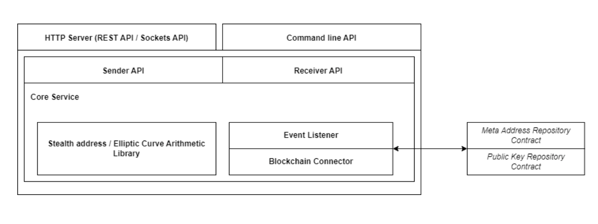
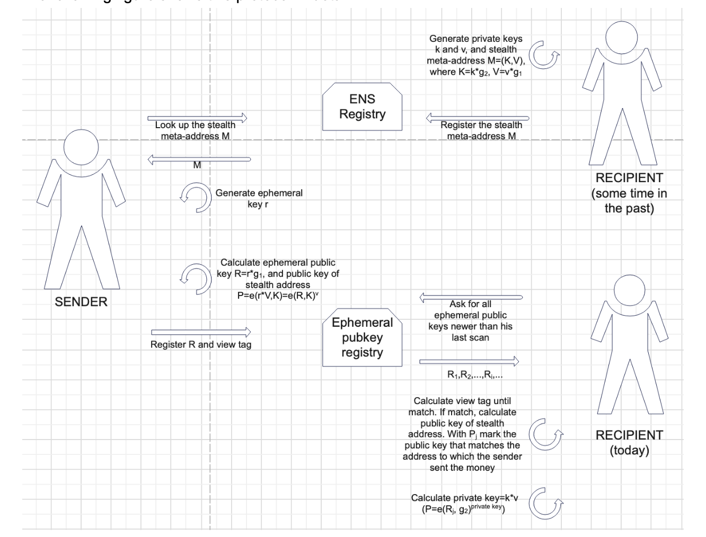
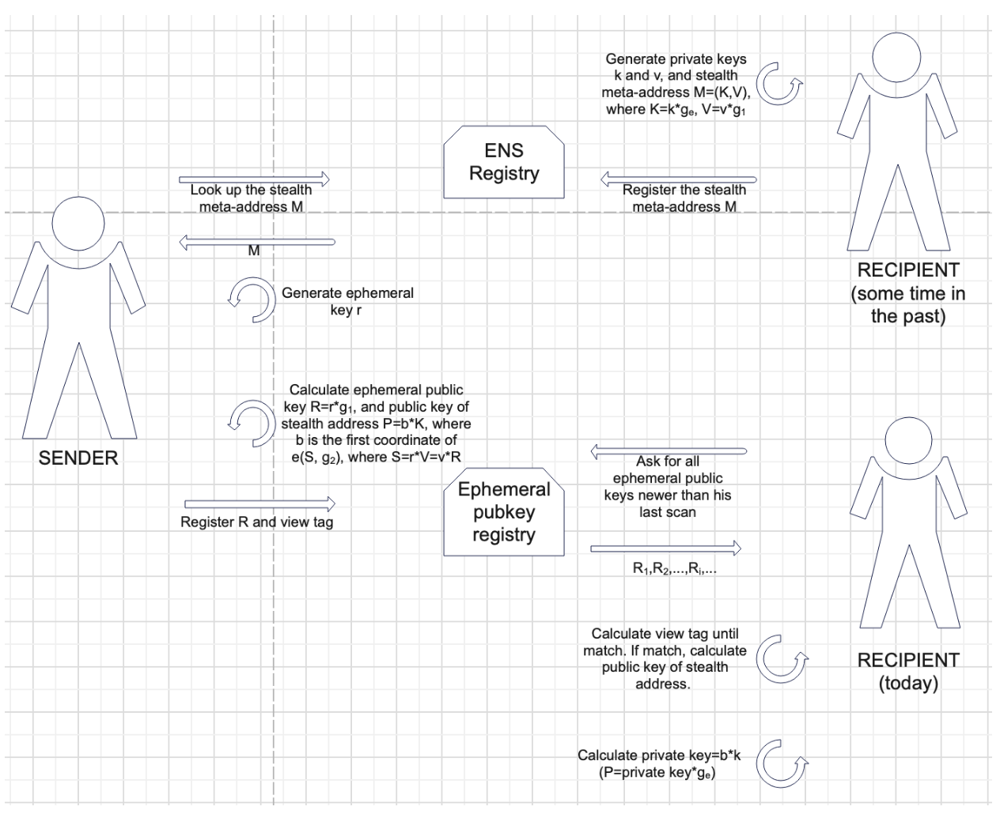
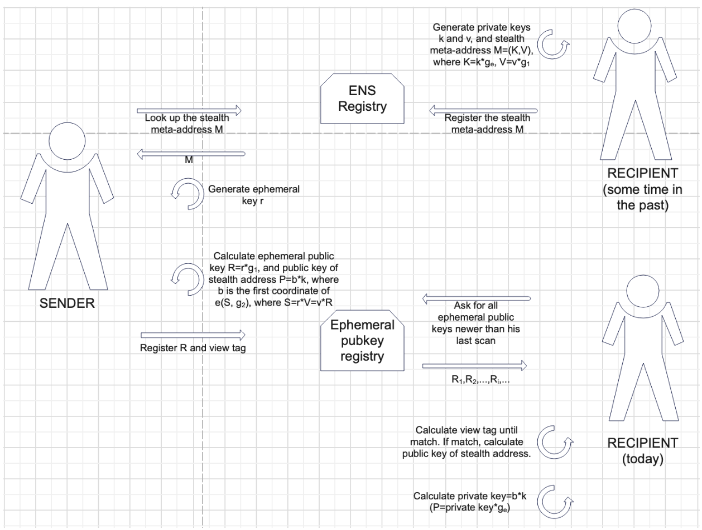
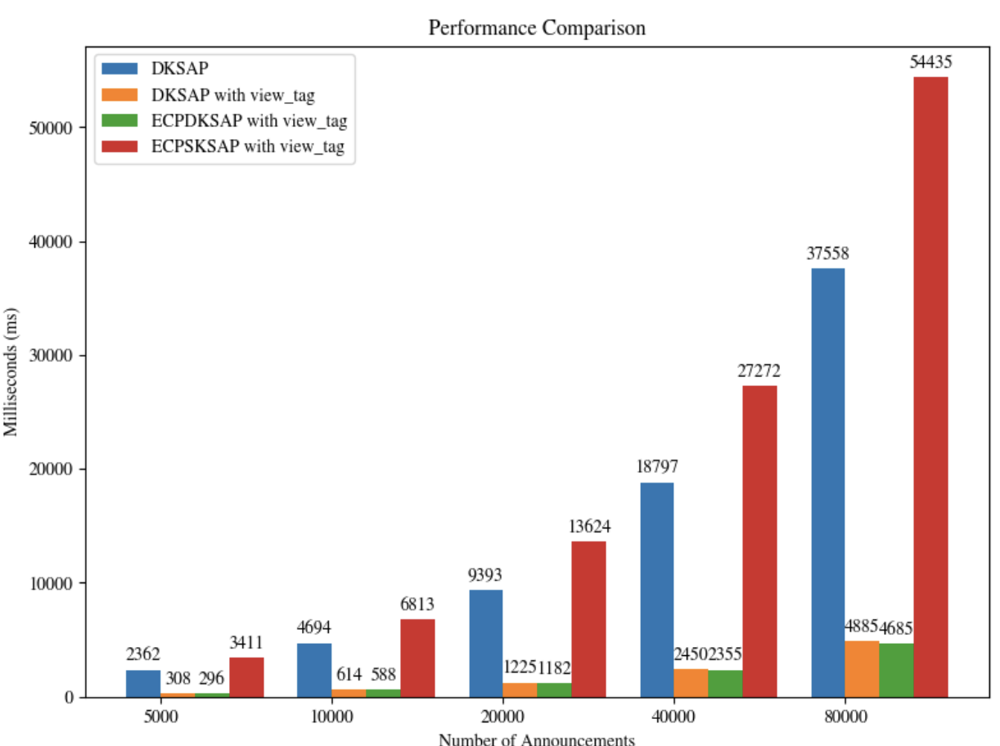

# Elliptic Curve Pairing Stealth Address Protocol

## Introduction

The protection of transaction privacy is extremely important for the user. With stealth address protocols (SAP), users can receive assets on stealth addresses that they do not link to their stealth meta-addresses. [SAP](https://vitalik.eth.limo/general/2023/01/20/stealth.html) can be generated using various cryptographic approaches. DKSAP ([BaseSAP: Modular Stealth Address Protocol for Programmable Blockchains](https://ieeexplore.ieee.org/document/10426757)) uses elliptic curve multiplication and hashing of the resulting shared secret. Another approach is to use a bilinear mapping. In [our paper](https://arxiv.org/pdf/2312.12131), we propose four protocols based on the elliptic curve pairing: ECPDKSAP (Elliptic Curve Pairing Dual-Key Stealth Address Protocol - three protocols) and ECPSKSAP (Elliptic Curve Pairing Single-Key Stealth Address Protocol). Here are the results of ECPDKSAPs with the view tags, which are better than the results of DKSAP with the view tag from [BaseSAP: Modular Stealth Address Protocol for Programmable Blockchains](https://ieeexplore.ieee.org/document/10426757). ECPSKSAP is significantly slower, but it represents an interesting theoretical result because it uses only one private key.

ECPDKSAPs are a pairing-based protocols that includes the viewing key and spending key. We have implemented three different variants of the ECPDKSAP protocol:
Protocol 1: Multiple addresses correspond to one private key and it is not Ethereum-friendly;
Protocol 2: One private key corresponds to exactly one address and it is not Ethereum-friendly;
Protocol 3: One private key corresponds to exactly one address and it is Ethereum-friendly.

## Technical details

To make the library available to non-developer users, we implemented a software system that utilizes the library and exposes the method to send and receive funds over stealth addresses. The system includes:

Meta address registry and public key smart contracts (Helper smart contract to interact with DKSAP);
The core system containing:
Blockchain connectors;
Event listeners;
Stealth address library with elliptic curve operations used in stealth address cryptography;
Sender and receiver API, exposing Go methods for sending and receiving funds using stealth addresses;
HTTP REST and socket services for exposing the methods via REST and sockets API;
CLI API, enabling sending and receiving funds using a command line interface.

A diagram describing the software architecture is shown in the figure below.

## Elliptic curve pairing

Let $E$ be an elliptic curve over a finite field $K$. Let $G_1$ and $G_2$ be additively-written subgroups of order $p$, where $p$ is a prime number, of the elliptic curve $E$, and let $g_1 \in G_1$, $g_2 \in G_2$ are the generators of groups $G_1$ and $G_2$ respectively. A map $e: G_1 \times G_2 \rightarrow G_T$, where $G_T$ is a multiplicatively-written subgroup of $K$ of order $p$, is called an elliptic curve pairing if satisfies the following conditions:
$e(g_1, g_2) \neq 1$; 
$\forall R,S \in G_1, \forall T \in G_2: e(R+S,T) = e(R,T)*e(S,T)$;
$\forall R \in G_1, \forall S,T \in G_2: e(R,S+T) = e(R,S)*e(R,T)$. 

Properties of the elliptic curve pairing:
$\forall S \in G_1, \forall T \in G_2: e(S,-T) = e(-S,T)=e(S,T)^{-1}$;
$\forall S \in G_1, \forall T \in G_2: e(a*S,b*T) = e(b*S,a*T)=e(S,T)^{a*b}$. 

Three basic types of bilinear map $e: G1 \times G2 \rightarrow G_T$ are:
Type 1: $G_1 = G_2$, and we say $e$ is a symmetric bilinear map;
Type 2: $G_1 \neq G_2$ and there exists an efficient homomorphism  $\phi: G_2 \rightarrow G_1$, but no efficient one exists in the other direction;
Type 3: $G1 \neq G_2$ and there exists no efficient homomorphism between $G_1$ and $G_2$.

## Elliptic Curve Pairing Double Key Stealth Address Protocols (ECPDKSAPs)

ECPDKSAPs use Type 3 pairing. Let $g_1$ and $g_2$ be generators of subgroups $G_1$ and $G_2$ of a pairing-friendly elliptic curve that has the same order $p$ ($p$ is a prime number).

### Spending key and viewing key

The recipient of the transaction in this protocol will generate two key pairs. The first key pair is the private key (spending key) $k$ and the corresponding public key $K$. The spending key is the private key of the stealth meta-address and is a number from the final field $F_p$ - the finite field associated with the pairing-friendly curve. Although it is called the "spending key", it is not actually the private key of the new stealth address, but it is crucial for obtaining the private key of each stealth address of the recipient. The public key, which corresponds to the spending key, is obtained by multiplying $g2$ by $k$, i.e. $K=k*g2$ (in Protocol 1 and Protocol 2), where $g2$ is generator point of subgroup $G2$ of pairing-friendly elliptic curve, and $k$ is from $Fp$, and in Protocol 3 spending key is obtained by multiplying $g_e$ by $k$, i.e. $K=k*g_e$, where $g_e$ is the generator point of the group of the secp256k1 curve and $k$ is from $Fp_2$ - the finite field associated with a Koblitz curve secp256k1.

Viewing key as a concept appeared later. Namely, the recipient of the transaction can give this key to someone if that person needs to be able to see all his stealth transactions (e.g. to a tax inspector). An important note is that the person holding this key cannot spend money from stealth addresses, but can only see transactions. The viewing key $v$ is a private key, i.e. a number from the final field $F_p$. The public key corresponding to the viewing key is $V$ is obtained by multiplying $v$ and $g_1$, i.e. $V=v*g_1$, where $g_1$ is the generator point of the subgroup $G1$ of pairing-friendly elliptic curve. In the ENS registry, the recipient only adds the public keys associated with the spending and viewing keys, i.e. the points $K$ and $V$ (note that $K$ and $V$ are points of the elliptic curve).

A detailed overview of the proposed protocols can be found in our paper, and the diagrams of all three ECPDKSAP protocols are shown below.

### Protocol 1

The full workflow of a stealth address scheme can be viewed as follows:

The recipient generates his spending key $k$ and viewing key $v$ and stealth meta-address $M=(K, V)$, where $K=k*g_2$ and $V=v*g_1$.
The recipient adds an ENS record to register $M$ as the stealth meta-address for recipient.eth.
We assume the sender knows that the recipient is recipient.eth. The sender searches for his stealth meta-address $M$ on ENS.
The sender generates an ephemeral key $r$ that only he knows, and that he only uses once (to generate this specific stealth address).
The sender uses an algorithm that combines his ephemeral key $r$ and the recipient's meta-address $M$ to generate a stealth address. The sender calculates the public key of the address as $e(r*V, K)$. He can now send assets to this address.
The sender also generates his ephemeral public key $R=r*g_1$ and publishes it to the ephemeral public key registry. To optimize the calculation of address by the recipient, the sender will calculate and send a view tag (more words about the view tag will be below).
For the recipient to discover stealth addresses belonging to him, he needs to scan the ephemeral public key registry for the entire list of ephemeral public keys published by anyone for any reason since the last time he did the scan (he will use the view tag). 
The recipient's private key of stealth address is $k*v$ and he will calculate the public key of the address as $e(R,g_2)^{private key}$.

The following figure shows this protocol in detail.  

Figure 1. ECPDKSAP Protocol 1

### Protocol 2

The full workflow of a stealth address scheme can be viewed as follows:

The recipient generates his spending key $k$ and viewing key $v$ and stealth meta-address $M=(K, V)$, where $K=k*g_2$ and $V=v*g_1$.
The recipient adds an ENS record to register $M$ as the stealth meta-address for recipient.eth.
We assume the sender knows that the recipient is recipient.eth. The sender searches for his stealth meta-address $M$ on ENS.
The sender generates an ephemeral key $r$ that only he knows, and that he only uses once (to generate this specific stealth address).
The sender uses an algorithm that combines his ephemeral key $r$ and the recipient's meta-address $M$ to generate a stealth address. The sender calculates the public key of the address as $e(hash(r*V)*g_1, K)$. He can now send assets to this address.
The sender also generates his ephemeral public key $R=r*g_1$ and publishes it to the ephemeral public key registry. To optimize the calculation of address by the recipient, the sender will calculate and send a view tag.
For the recipient to discover stealth addresses belonging to him, he needs to scan the ephemeral public key registry for the entire list of ephemeral public keys published by anyone for any reason since the last time he did the scan (he will use the view tag). 
The recipient's private key of stealth address is $k*hash(v*R)$ and he will calculate the public key of the address as $e(g_1,g_2)^{private key}$.

The following figure shows this protocol in detail.  

Figure 2. ECPDKSAP Protocol 2

### Protocol 3

The full workflow of a stealth address scheme can be viewed as follows:

The recipient generates his spending key $k$ and viewing key $v$ and stealth meta-address $M=(K, V)$, where $K=k*g_e$ and $V=v*g_1$.
The recipient adds an ENS record to register $M$ as the stealth meta-address for recipient.eth.
We assume the sender knows that the recipient is recipient.eth. The sender searches for his stealth meta-address $M$ on ENS.
The sender generates an ephemeral key $r$ that only he knows, and that he only uses once (to generate this specific stealth address).
The sender uses an algorithm that combines his ephemeral key $r$ and the recipient's meta-address $M$ to generate a stealth address. The sender calculates the public key of the address as $b*K$, where $b$ is the first coordinate of $e(r*V,g_2)$. He can now send assets to this address.
The sender also generates his ephemeral public key $R=r*g_1$ and publishes it to the ephemeral public key registry. To optimize the calculation of address by the recipient, the sender will calculate and send a view tag.
For the recipient to discover stealth addresses belonging to him, he needs to scan the ephemeral public key registry for the entire list of ephemeral public keys published by anyone for any reason since the last time he did the scan (he will use the view tag). 
The recipient's private key of stealth address is $b*k$ and he will calculate the public key of the address as $private key*g_e$.

The following figure shows this protocol in detail.  

Figure 3. ECPDKSAP Protocol 3

## View tag

To make it easier to scan the total set of ephemeral public keys, one technique is to add a view tag to each ephemeral public key. There are different ways to implement this idea. One way to achieve this in the above mechanism is to make the view tag be one byte of the x-coordinate of the point r*V, or the first byte of hash(r*V) or two bytes of hash(r*V). Note that this hash(r*V) do not need to be in the finite field $F_p$.

For example, if we choose that view tag is one byte of the x-coordinate of the point r*V, the recipient only needs to do a single elliptic curve multiplication for each ephemeral public key to compute the view tag, and only 1/256 of the time would the recipient need to do a more complex calculation to generate and check the full address. 
If the view tag is two bytes of the hash(r*V), recipient needs only 1/65536 of the time to check the full address.

We have implemented for all three protocols ECPDKSAP all three versions of the view tag and in the implementation results we will show the time required for the recipient to calculate its stealth address. Also, security analysis will be shown for each view tag in each of the protocols.

### Optimization results

In order to improve the results of [our paper](https://arxiv.org/pdf/2312.12131) for which we received a grant from the ETH Foundation, we applied several different types of optimization:
Optimization at the protocol level;
View tag optimization;
Optimization using different elliptic curves and pairings;
Implementation (low level) optimization.

Our protocol optimization led us to create Protocol 2 and Protocol 3. Protocol 2 is an improvement of Protocol 1 so that each private key corresponds to exactly one public key of the address, but it is not Ethereum friendly. Protocol 3 is an improvement of Protocol 2 which is Ethereum friendly.

Considering the changes related to the number of bytes of the view tag led us to the conclusions that there is no limit on the number for Protocol 3, which enables a significant acceleration, especially when looking at a registry with a large number of ephemeral keys.

By changing some pairing-friendly elliptic curves, we have found that the best results (shortest time) are obtained precisely for curve BN254 using the optimal Ate pairing.

The results obtained by low-level optimization of the implementation are based on the changes in the gnark-crypto library and have led to a percentage time saving compared to using the original library.

The best results of all the above optimizations will be shown in the chapter Implementation results.

### Implementation results

In the initial implementation results, we found that Protocol 1 (with a view tag of one byte of the hash(r*V)) performs better than DKSAP with the same view tag. The results can be seen in Figure 4.

Figure 4. Protocol 1 with the view tag performance (green) vs DKSAP with the view tag performance (orange) for different numbers of announcements.

​​
We have also performed initial implementations of all three ECPDKSAPs for all three versions of the view tag and have come to the following conclusions:
the fastest is Protocol 3 for all versions of the view tag and the slowest is Protocol 1 
for all three protocols, the fastest version of the view tag is two bytes of hash(r*V) and the slowest version is when the view tag is one byte of hash(r*V).

Detailed implementation results will be added later.

