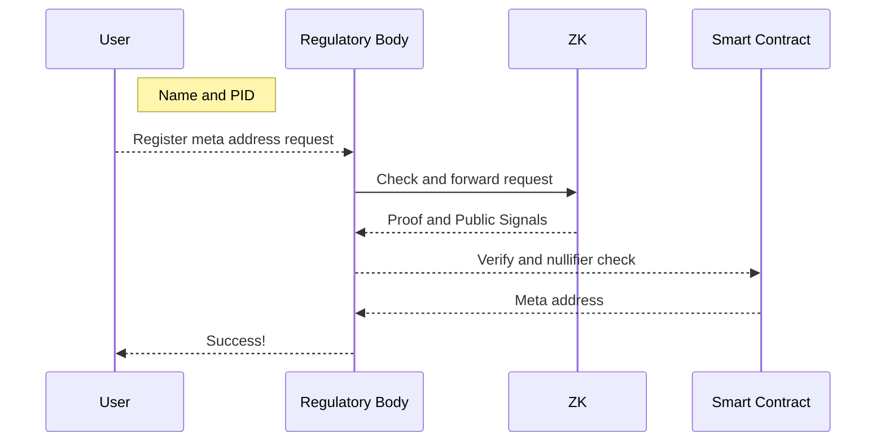

# STEALTH ADDRESS REGULATOR

## OVERVIEW

The Stealth Address Regulator is an innovative system designed to enable enhanced privacy in blockchain transactions through the use of stealth addresses, while simultaneously implementing a regulatory mechanism to prevent potential misuse. At its core, the project allows users to register and utilize stealth addresses, but with a critical constraint: each account is permitted to register only one meta stealth address within a given registry. Stealth addresses are a cryptographic technique that generates one-time addresses for each transaction, significantly improving privacy by making it extremely difficult to link multiple transactions to a single user. This technology is particularly valuable in public blockchain networks where all transactions are visible, offering a layer of confidentiality that is often lacking in traditional blockchain systems. While privacy is essential, the growing scrutiny of blockchain technologies by regulatory bodies worldwide necessitates a balanced approach. The limitation of one meta stealth address per account in each registry serves as a regulatory safeguard, potentially mitigating concerns related to money laundering, tax evasion, and other illicit activities that could exploit complete anonymity.

# ZK
## Inclucion proof

This Circom circuit, named inclusionProof, is designed to prove the inclusion of a leaf in a Merkle tree without revealing the leaf's contents. Here's a brief explanation:

**Inputs:**

- hashName: A hash value representing a name

-   pid: An identifier (possibly a personal ID)

-   privKey: A private key

-   path_elements: Merkle proof path elements

-   path_index: Indices for the Merkle proof path

-   publicVar: A public variable

-   root: The Merkle tree root

**Output:**

-   nullifier: A unique identifier generated from the inputs

**What the circuit does:**

- Converts the private key to a public key

-   Hashes the hashName, pid, and public key to create a leaf

-   Generates a nullifier using the inputs

-   Verifies the inclusion of the leaf in the Merkle tree

The main component is set up with 2 levels for the Merkle tree and declares publicVar and root as public inputs.

This circuit can be used in privacy-preserving applications where you need to prove membership in a set  (represented by the Merkle tree) without revealing the specific member, while also generating a unique nullifier to prevent double-spending or similar issues.

## Nullifier

This circuit creates a unique nullifier using the Poseidon hash function.

**Inputs:**

-   publicVar: Public value

-   hashName: Hash name

-   pid: Personal identifier

-   privKey: Private key

**Output:**

-   nullifier: Resulting unique identifier

**What happens:**

The circuit takes four inputs, feeds them into a Poseidon hash function, and produces a nullifier as output. This can be used in zero-knowledge proofs to demonstrate that an action occurred without revealing the specific inputs.

## Private to Public Key

**Inputs:**

-   privKey: A private key (scalar)

**Outputs:**

-   pubKey: A public key (array of 2 field elements representing a point on the BabyJubJub curve)

**Process:**

-   Defines constants for the BabyJubJub curve base point (BASE8) and the prime subgroup order (l).

-   Verifies that the input private key is less than the prime subgroup order.

-   Converts the private key to a 253-bit binary representation.

-   Performs scalar multiplication of the base point with the private key.

-   Outputs the resulting point as the public key.

This circuit implements the conversion of a private key to a public key on the BabyJubJub elliptic curve, which is commonly used in zero-knowledge proof systems. It ensures the private key is within the valid range and uses efficient elliptic curve operations for the conversion.

# Regulator

The Regulator class manages a Merkle tree of registered users, utilizing the Poseidon hash function for cryptographic operations. It provides functionality for user registration, Merkle proof generation, and persistence of the Merkle tree structure to and from files.

## Generate User Hash

**Input:**

-   name: string  - The user's name

-   pid: number - The user's personal identification number

-   pub_x: BigInt - The x-coordinate of the user's public key

-   pub_y: BigInt - The y-coordinate of the user's public key

**Output:**

-   BigInt: A unique hash representing the user

**Explanation:**

This function generates a unique hash for a user based on their name, personal identification number (PID), and public key coordinates. It first hashes the user's name using SHA-256, then combines this hash with the PID and public key coordinates using a Poseidon hash function. The resulting hash uniquely identifies the user within the system.

## Check for duplicates

**Inputs:**

-   name: string

-   pid: number

-   pub_x: BigInt

-   pub_y: BigInt

**Output:**

-   number  (index of the user in the tree if registered, -1 otherwise)

**Explanation:**

This method checks if a user is already registered by searching for their PID in the registered users file. It reads the file, compares each line's PID with the provided PID, and returns the user's index if found. If the user is not found or the file doesn't exist, it returns -1.

## Register User

**Inputs:**

-   name (string): The name of the user to be registered.

-   pid (number): The personal identification number (PID) of the user.

-   pub_x  (BigInt): The x-coordinate of the user's public key.

-   pub_y (BigInt): The y-coordinate of the user's public key.

**Output:**

-   Returns a  number representing the index of the user in the Merkle tree.

**Description:**

This method registers a new user in the system. It first checks if the user is already registered by calling the checkIfRegistered method. If the user is already registered, it returns the existing index. Otherwise, it generates a hash for the user using the  generateUserHash method, inserts the hash into the Merkle tree, and appends the user's information to the registered users file. The method returns the index of the newly registered user in the Merkle tree.

**The function performs the following steps:**

-   Checks if the user is already registered.

-   If not registered, generates a hash for the user.

- Inserts the user's hash into the Merkle tree.

-   Writes the user's information to the registered users file.

-   Returns the index of the user in the Merkle tree.

This method is crucial for maintaining the list of registered users and updating the Merkle tree accordingly.

## Proof for User

**Input:**

-   leafIndex (number): The index of the user in the Merkle tree for whom we want to generate a proof.

**Output:**

-   An array of tuples [string, number][], where each tuple contains:

-   A string representation of a sibling hash in the Merkle proof

-   The corresponding path index for that sibling

**Explanation:**

This method generates a Merkle proof for a user at the specified leaf index in the Merkle tree. It first checks if the leaf index is provided and if the Merkle tree is initialized. If either condition is not met, it throws an appropriate error.

The method then uses the getProof function from the Merkle tree implementation to obtain the proof. It processes this proof to create an array of tuples, where each tuple contains a sibling hash (converted to a string) and its corresponding path index.

This proof can be used to verify the inclusion of a user's data in the Merkle tree without revealing the entire tree structure, which is useful for privacy-preserving verification in various cryptographic protocols.

# Smart Contract

## Verifier

The verifyProof function is designed to verify a zero-knowledge proof using pairing-based cryptography.

**Inputs:**

- _pA: An array of 2 uint256 values representing a point on the elliptic curve G1.

-   _pB: A 2x2 array of uint256 values representing a point on the elliptic curve G2.

-   _pC: An array of 2 uint256 values representing another point on G1.

-   _pubSignals: An array of  3 uint256 values representing public inputs to the proof.

**Output:**

-   A boolean value: true if the proof is valid, false otherwise.

**Functionality:**

-   The function uses inline assembly for efficiency.

-   It first checks that all public inputs are within the valid field range.

-   It then computes a linear combination of the verification key elements with the public inputs.

-   The function performs several elliptic curve operations and pairings to verify the proof.

-   Finally, it checks if the pairing equation holds, which determines the validity of the proof.

This verifier is typically generated automatically by tools like Circom based on a specific zero-knowledge circuit. It's used to verify proofs created by a corresponding prover, ensuring that a prover knows a valid witness for the circuit without revealing the witness itself.

## Register Meta Address
Explanation of the registerMetaAddress function:

**Inputs:**

-   _id: A string representing the identifier for the meta address

-   _metaAddress: Bytes representing the meta address to be registered

-   _nullifier: A string used to prevent double registration

-   _pA, _pB, _pC, _pubSignals: Parameters for zero-knowledge proof verification

**Outputs:**

-   No direct return value, but emits events and updates state

**Function behavior:**

-   Generates a hash from the nullifier and checks if it's already used

-   If the nullifier is new, marks it as used and emits a  NullifierRegistered event

-   Verifies the zero-knowledge proof using the provided parameters

- If the proof is invalid, the function returns without further action

-   Creates an access key by hashing the _id with "string"

-   Checks if the meta address for this ID is already registered

- If not registered, stores the meta address and emits a MetaAddressRegistered event

This function registers a new meta address, ensuring uniqueness through nullifiers and validating the registration with a zero-knowledge proof.
